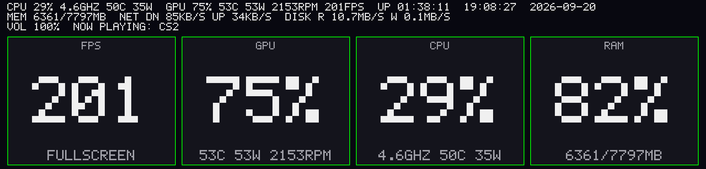

# trofeo_lcd

**A lightweight, open-source alternative to the official Thermalright TRCC
software.** Audio visualizer + system info monitor for the
**Thermalright Trofeo Vision 9.16 LCD** (USB `0416:5408`, "LY" protocol).

This project is a fork of [sukualam/trofeo-lcd](https://github.com/sukualam/trofeo-lcd),
whose driver was rewritten byte-for-byte from
[thermalright-trcc-linux](https://github.com/Lexonight1/thermalright-trcc-linux).
See **[NOTICE.md](./NOTICE.md)** for the full provenance and a summary of
what this fork adds on top of the original.

The display **adapts automatically to what your computer is doing** — no
manual switching needed. The Trofeo LCD shows one of these views below
depending on the moment:

**Idle** — audio is quiet, so the EQ bars are low and the top bar shows
system info: CPU usage & real-time frequency, RAM, uptime, clock and date.


**Media** — a song is playing: the stripes follow the music, and the top bar
shows the now-playing track (title/artist/album from the media controls).


**Gaming** — a game is in the foreground: game info is detected and the
system status (CPU/GPU/RAM/temp) stays readable while playing.



## Features

- EQ bars (48) from currently playing audio (WASAPI loopback on Windows,
  PulseAudio/PipeWire on Linux), colored green→yellow→red.
- System info: CPU %, real-time CPU frequency, RAM, uptime, clock & date.
- Can also drive a **DeepCool** display (sends CPU data over HID).
- **Second monitor mode** (`trofeo_screen`): the LCD becomes a real second
  monitor.
- Current **weather** (temperature + a stylized condition icon), auto-detected
  from your IP or a city you set.
- Sync EQ bar color with an **OpenRGB** device.
- Adaptive FPS: drops to idle when silent → saves CPU.

## Usage

```bash
cargo build --release
./target/release/trofeo_lcd      # Windows: .\target\release\trofeo_lcd.exe
```

**Windows** — to read AMD CPU temp/power, install
[PawnIO](https://github.com/namazso/PawnIO) and run as Administrator.

**Linux** — needs `pkg-config` + PulseAudio headers to build, and
`playerctl` for song titles. For USB access without `sudo`, install
`99-trofeo-lcd.rules` (see the file's contents).

### Windows Defender / antivirus false positive

Windows may flag `trofeo_lcd.exe` or `trofeo_screen.exe` as a virus (often a
generic detection like `Trojan:Win32/Wacatac`) and delete it on download or
on first run. **This is a false positive**, common for small, unsigned Rust
executables that do low-level system things — raw USB/HID access (DeepCool
integration), a global hotkey (screenshot), ETW tracing (FPS monitor), and
screen capture (`trofeo_screen`) — each of which happens to match a pattern
heuristic antivirus engines associate with malware, even though the full
source is public and does none of it maliciously.

- A VirusTotal scan of a recent build (~70 engines) is here:
  [virustotal.com/gui/file/75265a7e...](https://www.virustotal.com/gui/file/75265a7e271ed8a5e82cf0fd20a7c2fa3b122cc878bbe66ec90dfe704d16fe60)
  — if you get a similar result on a newer build, it's safe to trust the
  same way.
- If Windows deletes the file, restore it from **Windows Security → Virus &
  threat protection → Protection history** (don't disable real-time
  protection to work around this).
- Releases published from this repo are built directly from source by
  [GitHub Actions](./.github/workflows/release.yml) (public build log), not
  compiled on a personal machine — you can compare the workflow output to
  what you downloaded, or just build it yourself with `cargo build --release`.
- If you'd rather report it, Microsoft's false-positive submission page is
  <https://www.microsoft.com/en-us/wdsi/filesubmission>.

## Main options

For every option the program supports — config-file keys and command-line
flags, with defaults, valid values and examples — see the
**[Options guide](./OPTIONS_GUIDE.md)**. The table below covers just the
handful of flags that only exist on the command line.

| Option | Purpose | Default |
|---|---|---|
| `--idle-fps` / `--active-fps` | FPS when idle / has sound | `2` / `15` |
| `--no-deepcool` | Turn off DeepCool integration | enabled |
| `--deepcool-update-ms` | DeepCool send interval (100–2000 ms) | `1000` |
| `--openrgb-device <NAME>` | Sync color with an OpenRGB device | disabled |
| `--weather-city <NAME>` | Fixed city for the weather module | auto (IP-based) |
| `--hide-console` | Hide the console window (Windows) | disabled |
| `-k, --screenshot-key` | Global hotkey to save the current LCD frame as a lossless PNG screenshot (f1-f12, printscreen) | off |

## Orientation (landscape / portrait)

The panel is physically 1920×462. If you mount it upright, use portrait:
the UI is drawn on a 462×1920 canvas and rotated for the panel. Set it in a
config file (copy `trofeo.conf.example` to `trofeo.conf` next to the
executable, or pass `--config <FILE>`) or on the command line:

```bash
./trofeo_lcd --orientation portrait          # display mounted upright
./trofeo_lcd --orientation portrait --flip   # upright, but upside-down
```

`--flip` adds 180° in either orientation. Command-line options override the
config file. In `trofeo_screen` portrait mode the virtual display must be
**462×1920** (auto-detected by `--list-displays`).

## Margins, language, background

Also settable in `trofeo.conf` (see `trofeo.conf.example`) or via CLI:

- `--margin <PX>` (or `--margin-top/-bottom/-left/-right`): keep the UI away
  from the screen edges. Works in `trofeo_screen` too.
- `--language it` (default `en`): Italian UI text and date names.
- `--background <FILE>`: JPEG/PNG/BMP image, animated GIF, or video. Video
  needs **ffmpeg** (`ffmpeg.exe` next to the program, in `PATH`, or `--ffmpeg <PATH>`).
  `--background-dim <0-100>` darkens it (default 40). With an animated
  background the idle FPS is raised to the active FPS so it stays smooth.

### What to show, where, and colors

- `show = cpu, gpu, …` / `hide = spectrum, clock_date, …` choose what is drawn
  (`cpu gpu uptime time date mem net disk volume nowplaying spectrum clock
  clock_date dashboard`). Hiding `spectrum` keeps the big clock on screen
  during playback.
- `status_position`, `clock_position`, `spectrum_position` (+ `spectrum_width/height`)
  take one of 9 anchors: `top-left`, `top`, `top-right`, `center-left`,
  `center`, `center-right`, `bottom-left`, `bottom`, `bottom-right`.
- `text_color`, `clock_color`, `color` (bars): `#RRGGBB`, `R,G,B` or a name.
- `background_fit` (`cover|stretch|contain|original`), `background_position`,
  `background_offset_x/y`.

Every key is also a CLI flag (`--hide spectrum`, `--clock-position top-right`).

### Brightness, DeepCool, FPS

- `brightness = 0-100`: software dimming (no LY brightness command is known).
- `deepcool = false` (or `--no-deepcool`): never touch the DeepCool display.
- Game dashboard FPS works on any GPU via ETW (DirectX 9–12 games; run as
  Administrator; Vulkan/OpenGL-native games are not covered). NVIDIA GPU
  temperature/power/clock come from NVML (`nvml.dll`, shipped with the
  driver), falling back to `nvidia-smi`. `--diag` prints what each source
  returns.

### Weather

Current temperature and a small stylized condition icon (sun, cloud, rain,
snow, fog, thunder...), from [Open-Meteo](https://open-meteo.com/) (free, no
API key). By default the location is guessed from the machine's public IP
address; set `weather_city = Milano` (or `--weather-city`) to use a fixed city
instead — changing it needs a restart, since it re-spawns the background
fetch thread. `weather_unit = c` (default) or `f` picks the temperature unit,
and applies live. The weather can be shown two ways: as a per-item line named
`weather` (see "Per-item control" below, `default2`), and/or as its own big
panel (`layout = weather`, or e.g. `layout = default, weather` to rotate with
the standard screen). If the network is unreachable or the location
can't be resolved yet, the item just shows "N/A" until the first fetch
succeeds; nothing else in the program is affected. `--diag` also prints the
resolved location and a sample reading.

### Preset layouts

`layout = default | cpu-gpu | temps | overview | grid6 | clock-center | io | music | gaming | cpu | gpu | weather`
(`--layout list` prints them). Several layouts separated by commas rotate every
`layout_interval` seconds (`layout = cpu-gpu, temps, music`). Each entry can also carry its own
duration with `name:seconds`, instead of splitting the time equally — `layout = default:30, weather:5`
keeps the standard screen up for 30s straight, then the weather panel for 5s, then back to 30s of
the standard screen (not alternating every 5s); an entry with no `:seconds` falls back to
`layout_interval`. `default2` is the same screen but with the per-item styling below (`default`
stays classic; per-item options without any `layout` imply `default2`). `default` is the standard
screen (status lines, spectrum, big clock) and can be part of the rotation (`layout = default, cpu-gpu`).
`trofeo_lcd.exe --diag` prints NVIDIA/AMD GPU sensor diagnostics. `text_backdrop = true` puts a panel
behind the status lines and big clock (same opacity); `panel_opacity = 0-100`
makes panels see-through over the background. Big panels replace the clock; portrait stacks
them vertically. See `trofeo.conf.example`.

### Live reload

`trofeo.conf` is re-read every second; saved changes apply without restarting (a broken file is ignored and the previous settings stay). Only `deepcool`, `fps_monitor`, OpenRGB, `hide_console`, `screenshot_key` and `weather_city` need a restart. If a saved file is invalid, the previous settings stay active and the reason is written to `trofeo-errors.txt` next to the executable.

### Per-item control

Every info item (`cpu, gpu, uptime, time, date, mem/ram, net, disk, volume, nowplaying, weather`) can be
turned on/off with `show`/`hide` and styled on its own with `<item>_size` (1-30), `<item>_position`
(3x3 grid), `<item>_color` and `<item>_backdrop`. Setting any of them switches the info block to
per-item mode (items on the same position stack, and the track scrolls without overlapping its
neighbors). Details inside the CPU/GPU lines can be hidden with
`hide = cpu_freq, cpu_temp, cpu_power, gpu_temp, gpu_power, gpu_fan, gpu_clock, gpu_fps`.
`clock_time_size` / `clock_date_size` set the big clock's sizes, and `net_unit` (`kb|mb|auto`) /
`mem_unit` (`mb|gb`) set the network and RAM units.

## Second monitor mode

Run **`trofeo_screen`** (instead of `trofeo_lcd` — they share the LCD, so
don't run them together):

```bash
./target/release/trofeo_screen --list-displays    # list monitors
./target/release/trofeo_screen                    # stream to LCD
```

Requires a *Virtual Display Driver* (VDD) at 1920×462 — see
**[GUIDE_SECOND_MONITOR.md](./GUIDE_SECOND_MONITOR.md)**.

## Structure

- `src/lib.rs` — USB driver: handshake, chunking, JPEG encode, `Framebuffer`.
- `src/audio.rs` — audio capture (WASAPI / PulseAudio-PipeWire).
- `src/cpu_sensor.rs`, `src/cpu_freq.rs` — CPU temp/power & frequency.
- `src/deepcool/` — DeepCool display drivers (HID).
- `src/dxgi_capture.rs` + `src/bin/screen.rs` — second monitor mode.
- `src/weather.rs` + `src/weather_icon.rs` — weather (Open-Meteo) and its condition icons.
- `src/main.rs` — main loop: audio → FFT → EQ bars → send to screen.

## Performance

Measured on a Windows PC (12 logical processors), running `trofeo_lcd` at
default settings (idle FPS 2 / active 15, DeepCool enabled):

| Metric | Measured |
|---|---|
| RAM | ~13 MB working set (stable, no growth) |

It stays this light thanks to adaptive FPS (JPEG encode + USB transfer only
happen while there is audio) and the CPU optimizations in `src/main.rs` /
`src/lib.rs`.

## Credits

- Original project: [sukualam/trofeo-lcd](https://github.com/sukualam/trofeo-lcd)
  — this repository is a fork of it.
- USB protocol reverse-engineering:
  [thermalright-trcc-linux](https://github.com/Lexonight1/thermalright-trcc-linux)
  by Lexonight1.
- See **[NOTICE.md](./NOTICE.md)** for what has changed in this fork.

## License

[GPL-3.0-or-later](./LICENSE) (follows the referenced upstream project).
